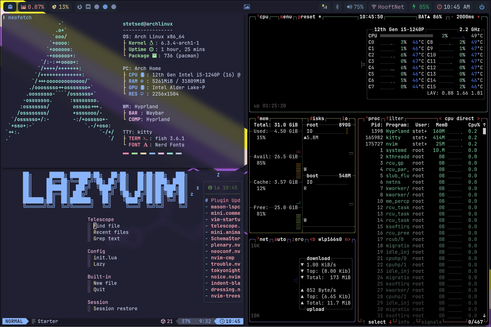
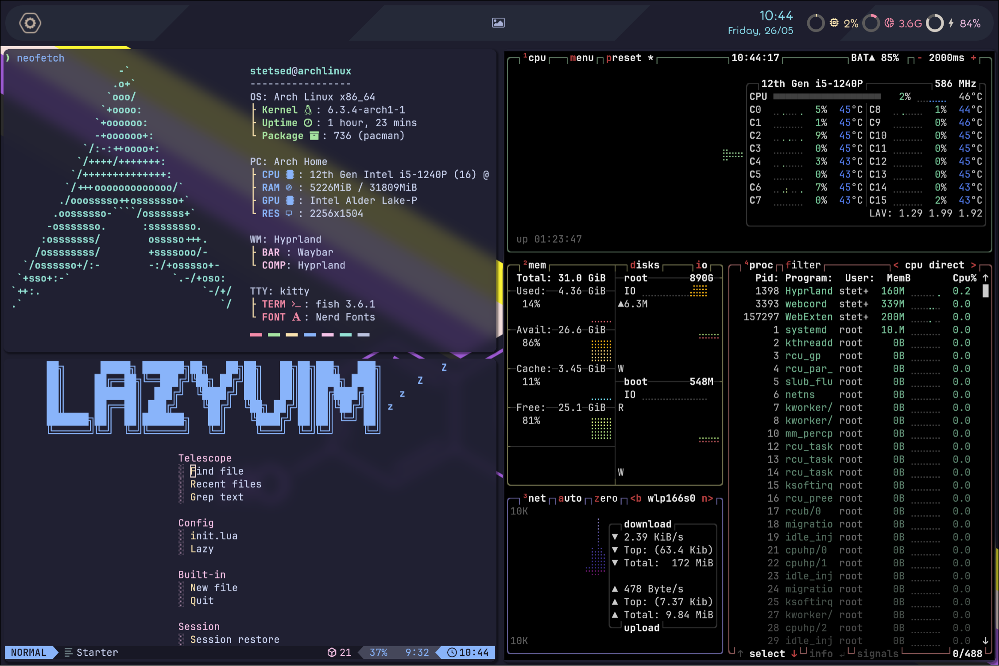
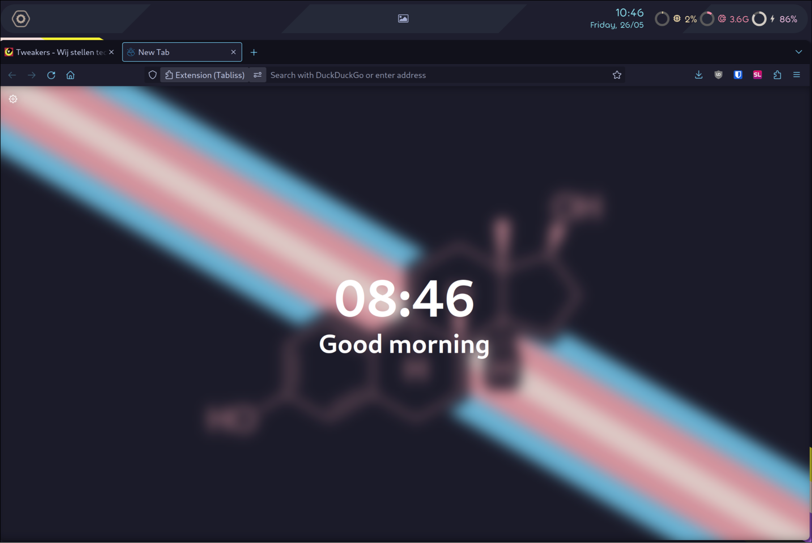
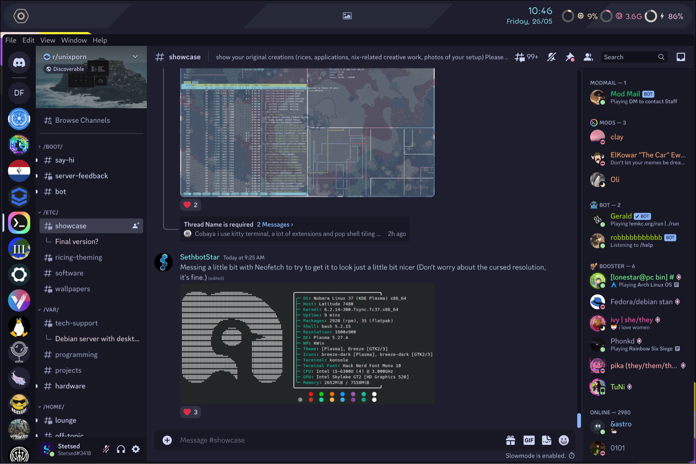
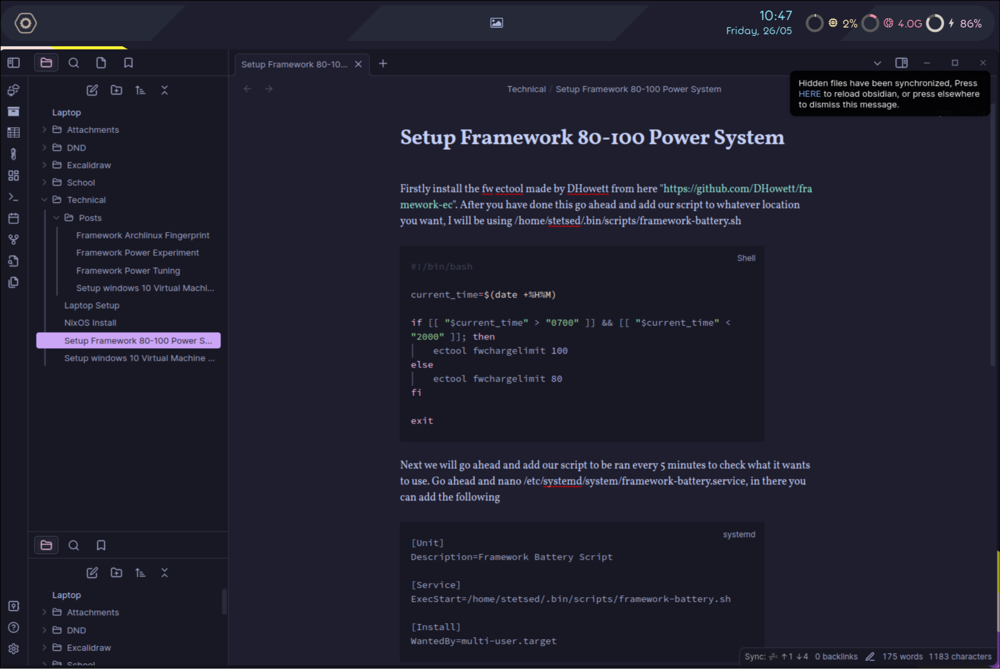

[](https://github.com/Stetsed/.dotfiles/commits/main)


# Stetsed's Dotfiles

Welcome to my Dotfiles repository which I use for my linux desktop. I hope this helps you to find what your looking for and be able to improve your own Linux Desktop. My setup basically always uses the Catppuccin Mocha Color scheme so you will find alot of that.

## Programs

- Theme: [Catppuccin Mocha](https://github.com/catppuccin/catppuccin)
- Window Manager: [Hyprland](https://github.com/hyprwm/Hyprland)
- Terminal: [Kitty](https://github.com/kovidgoyal/kitty)
- Shell: [Fish](https://github.com/fish-shell/fish-shell)
- Panel: [Waybar](https://aur.archlinux.org/packages/waybar-hyprland-git)
- Application Launcher: [Rofi](https://github.com/davatorium/rofi)
- Nvim Configuration: [LazyVim](https://github.com/LazyVim/LazyVim)
- Browser: [LibreWolf](https://librewolf.net/) + [Catppuccin Mocha Saphire](https://github.com/catppuccin/firefox/releases/download/old/catppuccin_mocha_sapphire.xpi)
- Discord: [WebCord](https://github.com/SpacingBat3/WebCord) + [Catppuccin Mocha](https://github.com/catppuccin/discord)
- Note Taking App: [Obsidian](https://obsidian.md/) + [Catppuccin Mocha](https://github.com/catppuccin/obsidian)

## Modifications that need to be made to use Dotfiles

- For Paru I use a custom pacman.conf which is hardcoded to my user directory, change this in ~/.config/paru/paru.conf
- Modify the specified battery in ~/.config/eww/modules/sys.yuck and ~/.config/eww/scripts/battery.
- Modify ~/.config/eww/windows/dashfs.yuck when I got it it had all hardcoded and I can't figure out how to unhardcode it so you gotta fix it for your resolution :|
- Currently by default I use my Eww bar because I like it more but I also have a waybar bar which you can enable by removing the "eww open bar" from the hypr execs and uncommenting the waybar command. 
- Other changes which I might not have noted here, please don't just copy some random persons dotfiles and expect them to work.

### [Packages](https://github.com/Stetsed/.dotfiles/blob/main/.packages.list)

## Install Script

Run the below command inside of an archlinux ISO to setup a ZFS system, and enter Stetsed/.dotfiles at the repository stage to use my dotfiles

```bash
bash -c "$(curl -Ls selfhostable.net/install)"
```

## Acknowledgements

 - [Dotfiles](https://github.com/linuxmobile/hyprland-dots) Dotfiles which I heavily used to inspire my creation, thanks for the examples :D.

 - [Ewww](https://github.com/end-4/dots-hyprland) base repository I used for basically all my eww stuff and just modified it and removed stuff I didn't need, big credits.

## Screenshots

<details>
  <summary>Configuration with Waybar System bar</summary>

  
</details>

<details>
  <summary>Configuration with Eww System bar</summary>

  

</details>

<details open>
  <summary>Rest of my Configuration</summary>

  

  

  
</details>
